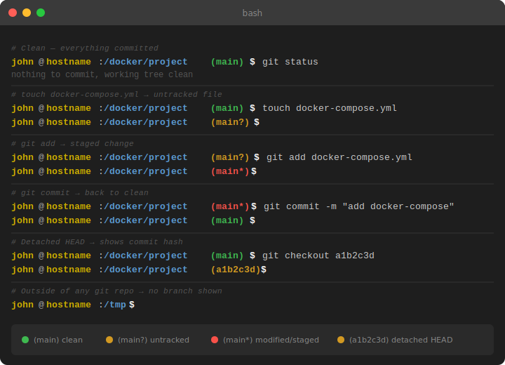

# Git-Aware Bash Prompt

A custom bash prompt that displays git repository status with color coding directly in the command line.

## Preview

A typical git workflow and how the prompt reacts at each step:



## Color Scheme

| Element         | Color  |
|-----------------|--------|
| `user`          | Yellow |
| `@`             | White  |
| `hostname`      | Yellow |
| `/path`         | Blue   |
| `(main)` clean  | Green  |
| `(main?)` untracked | Yellow |
| `(main*)` modified  | Red    |
| `$`             | White  |

## Installation

Add the following code to your `~/.bashrc`:

```bash
__git_info() {
    local branch untracked modified color reset

    branch=$(git symbolic-ref --short HEAD 2>/dev/null) || \
    branch=$(git rev-parse --short HEAD 2>/dev/null) || return

    git diff --quiet 2>/dev/null            || modified="*"
    git diff --cached --quiet 2>/dev/null   || modified="*"
    [ -n "$(git ls-files --others --exclude-standard 2>/dev/null)" ] && untracked="?"

    reset="\001\e[0m\002"

    if [ -n "$modified" ]; then
        color="\001\e[1;31m\002"
    elif [ -n "$untracked" ]; then
        color="\001\e[1;33m\002"
    else
        color="\001\e[1;32m\002"
    fi

    echo -e " ${color}(${branch}${modified}${untracked})${reset}"
}

PS1='\[\e[1;33m\]\u\[\e[0;37m\]@\[\e[1;33m\]\h\[\e[0m\]:\[\e[1;34m\]\w\[\e[0m\]$(__git_info)\[\e[1;37m\]\$\[\e[0m\] '
```

Then apply the changes:

```bash
source ~/.bashrc
```

## How It Works

### The `__git_info` Function

This function is called every time a new prompt is rendered. It checks the current git state and returns a colored string with the branch name and status symbols.

#### 1. Detecting the Branch Name

```bash
branch=$(git symbolic-ref --short HEAD 2>/dev/null) || \
branch=$(git rev-parse --short HEAD 2>/dev/null) || return
```

- `git symbolic-ref --short HEAD` returns the current branch name (e.g. `main`)
- If that fails (detached HEAD state), `git rev-parse --short HEAD` returns the short commit hash instead (e.g. `a1b2c3d`)
- If both fail, the function exits silently — meaning the prompt shows no git info at all when outside a repo
- `2>/dev/null` suppresses any error output

#### 2. Detecting Unstaged Changes

```bash
git diff --quiet 2>/dev/null || modified="*"
```

- `git diff --quiet` checks for differences between the working directory and the index (staging area)
- If there are changes, the exit code is non-zero, so `modified="*"` gets set

#### 3. Detecting Staged Changes

```bash
git diff --cached --quiet 2>/dev/dev/null || modified="*"
```

- `git diff --cached` compares the staging area to the last commit
- Catches files that have been staged with `git add` but not yet committed

#### 4. Detecting Untracked Files

```bash
[ -n "$(git ls-files --others --exclude-standard 2>/dev/null)" ] && untracked="?"
```

- `git ls-files --others` lists files that git doesn't track yet
- `--exclude-standard` respects `.gitignore` rules, so ignored files don't trigger the indicator
- If the output is non-empty (`-n`), `untracked="?"` gets set

#### 5. Choosing the Color

```bash
if [ -n "$modified" ]; then
    color="\001\e[1;31m\002"   # Red
elif [ -n "$untracked" ]; then
    color="\001\e[1;33m\002"   # Yellow
else
    color="\001\e[1;32m\002"   # Green
fi
```

Priority order:
1. **Red** — modified or staged changes (action required)
2. **Yellow** — only untracked files (new files not yet added)
3. **Green** — working tree is clean

#### 6. Why `\001` and `\002` Instead of `\[` and `\]`

Bash uses `\[` and `\]` in PS1 to mark non-printable sequences (like color codes), so the terminal can correctly calculate the cursor position. However, these escape sequences only work directly inside PS1 — not inside a function's output. Inside functions, the raw ASCII equivalents `\001` (start) and `\002` (end) must be used instead.

### The PS1 Variable

```
\[\e[1;33m\]\u   → username in bold yellow
\[\e[0;37m\]@    → @ in white
\[\e[1;33m\]\h   → hostname in bold yellow
\[\e[0m\]:       → colon in default color
\[\e[1;34m\]\w   → full current path in bold blue
\[\e[0m\]        → reset color before git info
$(__git_info)    → calls the function above
\[\e[1;37m\]\$   → $ (or # for root) in bold white
\[\e[0m\]        → reset color at the end
```

### ANSI Color Reference

| Code | Color |
|------|-------|
| `\e[0m` | Reset |
| `\e[1;31m` | Bold Red |
| `\e[1;32m` | Bold Green |
| `\e[1;33m` | Bold Yellow |
| `\e[1;34m` | Bold Blue |
| `\e[0;37m` | White |
| `\e[1;37m` | Bold White |

## Status Symbols Reference

| Symbol | Meaning |
|--------|---------|
| *(none)* | Working tree is clean |
| `?` | Untracked files (not yet added to git) |
| `*` | Unstaged or staged changes |
| `*?` | Both modified and untracked files |

## Useful Git Commands

```bash
# Stage a file
git add filename

# Unstage a file (keeps the file, removes it from staging)
git restore --staged filename

# Unstage all files
git restore --staged .

# Remove a file from git tracking entirely (e.g. after adding to .gitignore)
git rm --cached filename

# Check current status
git status
```
